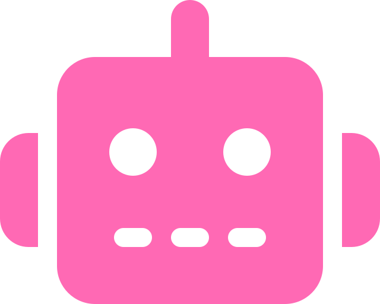

<a name="top"></a>

<!-- HEADER -->
<div align="center">
  
  
  
  # BoltHead

  [![Milestones][milestones-shield]][milestones-url]
  [![LastCommit][last-commit-shield]][last-commit-url]
  [![Stars][stars-shield]][stars-url]
  [![LinkedIn][linkedin-shield]][linkedin-url]
  
  A 3D WebGL Animation scene containing a fun lil robot. 
  <br />
  [**Explore the docs »**](https://github.com/cindyunrau/BoltHead)

  [View Demo](https://github.com/cindyunrau/BoltHead) •
  [Report Bug](https://github.com/cindyunrau/BoltHead) •
  [Request Feature](https://github.com/cindyunrau/BoltHead) 

</div>
<br />

<!-- TABLE OF CONTENTS -->
<details>
  <summary>Table of Contents</summary>
  <ol>
    <li><a href="#about-the-project">About The Project</a></li>
    <li><a href="#getting-started">Getting Started</a></li>
    <li><a href="#to-do">To-do</a></li>
    <li><a href="#deliverables">Deliverables</a></li>
    <li><a href="#resources">Resources</a></li>
  </ol>
</details>

<!-- ABOUT THE PROJECT -->
## About The Project
![Featured Image][featured-image]

Program in JavaScript/WebGL that draws an animated scene of the friendly robot BoltHead! Uses hierarchical transformations, the camera, textures, and shaders.

### Built With
* [![WebGL][webGL-shield]][webGL-url]
* [![Python][python-shield]][python-url]

<p align="right">
  <a href="#top">to the top!</a>
</p>

<!-- GETTING STARTED -->
## Getting Started

Do a few push-ups, then continue.

### Prerequisites

To use textures in WebGL we have to bypass a security issue that is present in most browsers. (Related to "Cross-origin image" Error) Below are three strategies to solve.

#### Python Server

* Navigate to code folder
* Run the server
   ```python -m http.server 8080```
* Open localhost in browser
   ```localhost:8080```
* Click on the HTML file

#### Firefox

* Go to:
  ```about:config```
* Find:
  ```security.fileuri.strict_origin_policy```
* Set to false

#### Chrome

* Close all running chrome instances
* Then start Chrome executable with a command line flag 
  ```chrome --allow-file-access-from-files```

<p align="right">
  <a href="#top">help i'm lost!</a>
</p>

<!-- USAGE EXAMPLES -->
## Deliverables

- [ ] Project Folder
- [ ] Movie File
- [ ] Image File

<p align="right">
  <a href="#top">up up and away!</a>
</p>

<!-- TO-DO -->
## To-do

| Done? | Description | Marks |
| :--- | :--- | :--- |
| | At least one two-level hierarchical object | **[4]** |
| | Make use of at least two textures either procedural or mapped. You must map them to a(n) object(s) in a meaningful way. | **[6]** |
| | Convert the Phong to Blinn-Phong in the new assignment base code fragment shader created in the previous step. | **[5]** |
| | Convert the ADS shader in the assignment base code from a vertex shader to a fragment shader. | **[2]** |
| | At least one shader edited or designed from scratch to perform a clearly visible effect. Each line of your shader code must be commented clearly explaining exactly what the following line does and why. You must clearly identify the purpose and effect the shader produces in the submitted README. | **[5]** |
| | 360 degrees camera fly around using lookAt() and setMV(). | **[4]** |
| | Connection to real-time. You should make sure that your scene runs in real-time on fast enough machines. Real-time means that one simulated second corresponds roughly to one real second. | **[4]** |
| | You should display the frame rate of your program in the console window or the graphics window once every 2 seconds. | **[2]** |
| | Complexity: scene setup and design, movement of animated elements, and programming. | **[5]** |
| | Creativity: storytelling, scene design, object appearance and other artistic elements.  | **[5]** |
| | Quality:  Attention to detail, modelling quality, rendering quality, motion control.  | **[5]** |
| | Programming style. | **[2]** |
| | Make and submit a movie of your animation. The movie should be at least 512x512 resolution and in a standard format, such as mp4. Include a cover image (png or jpg) of at least 512x512 pixels. | **[-2]** |
| | Provide a readme.txt that describes what you have done, what you have omitted, and any other information that will help the grader evaluate your work, including what is stated below.  | **[-4]** |

<p align="right">
  <a href="#top">beam me up!</a>
</p>

<!-- RESOURCES -->
## Resources

### Public Use Images

* [Wiki Commons](https://commons.wikimedia.org/wiki/Main_Page)
* [PARIS MUSÉES](https://www.parismuseescollections.paris.fr/en)
* [Smithsonian Open Access](https://www.si.edu/OpenAccess)


:heart:
:yellow_heart:
:green_heart:
:blue_heart: 
:purple_heart:

<!-- BADGES -->
[milestones-shield]: https://img.shields.io/github/milestones/all/cindyunrau/BoltHead?color=%23ff69b4&style=for-the-badge
[milestones-url]: https://google.ca
[last-commit-shield]: https://img.shields.io/github/last-commit/cindyunrau/BoltHead/main?color=%2300ffff&style=for-the-badge
[last-commit-url]: https://github.com/cindyunrau/BoltHead/commits/main
[stars-shield]: https://img.shields.io/github/stars/cindyunrau/BoltHead.svg?color=%23fff740&style=for-the-badge
[stars-url]: https://github.com/cindyunrau/BoltHead
[linkedin-shield]: https://img.shields.io/badge/-LinkedIn-black.svg?style=for-the-badge&logo=linkedin&colorB=555
[linkedin-url]: https://linkedin.com/in/cindyunrau
[webGL-shield]: https://img.shields.io/badge/WebGL-990000?logo=webgl&logoColor=white&style=for-the-badge
[webGL-url]: https://get.webgl.org/
[python-shield]: https://img.shields.io/badge/python-3670A0?style=for-the-badge&logo=python&logoColor=ffdd54
[python-url]: https://www.python.org/

<!-- IMAGES -->
[featured-image]: images/robot.gif
